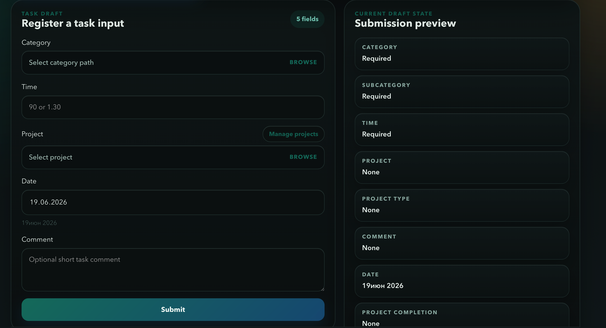
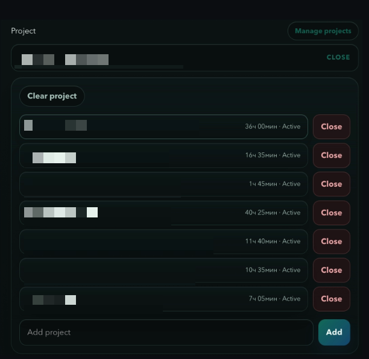
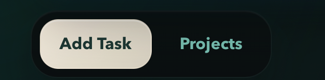
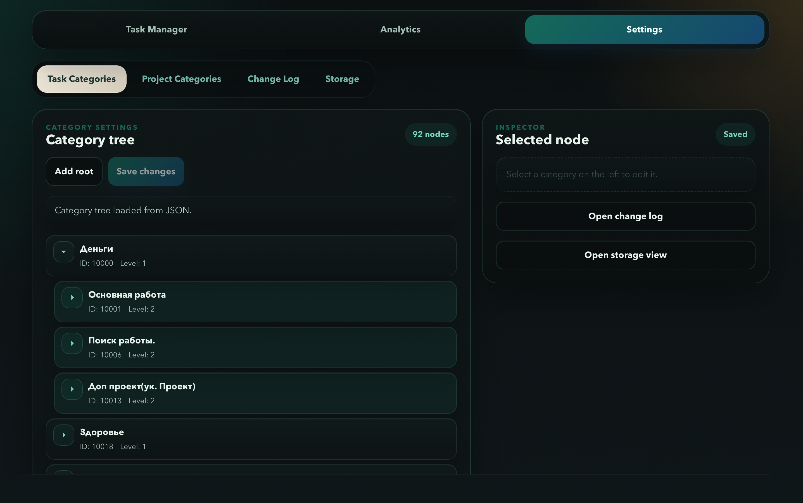
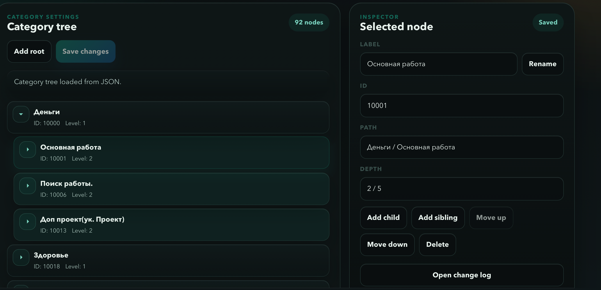
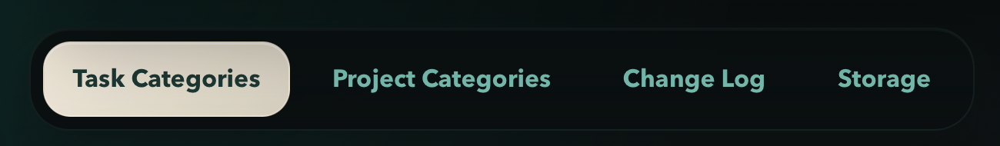
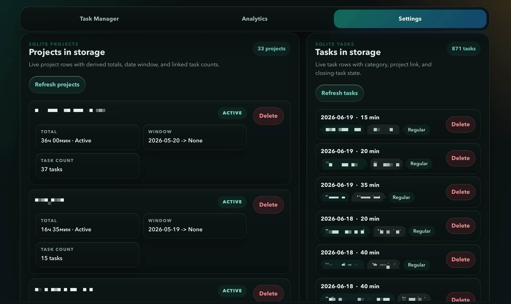

# System-I2: вступление

Это моя самописная программа для тайм-менеджмента, построенная на отношении ко времени. Сегодня расскажу, что она делает, чего она НЕ делает, как ей пользоваться и немного о самой системе учёта времени.

> [!NOTE]
> Лучше читать всё по очереди, хотя бы по диагонали.

## Содержание

- [Важные уточнения](#важные-уточнения)
- [Что делает программа](#что-делает-программа)
- [Учёт времени](#учёт-времени)
- [Проекты](#проекты)
- [Аналитика](#аналитика)
- [Практика. Что для чего нужно и куда нажимать?](#практика-что-для-чего-нужно-и-куда-нажимать)
- [Итого](#итого)

---

## Важные уточнения

### Первое

Программа пока не является релизной. Она местами кривая и со временем будет сильно расширяться. Изначально я делал её только для себя, а решение выпустить в публику принял спонтанно. Написана она вайб-кодом на Rust. Дорабатывать её руками у меня нет времени, а для продолжения вайб-кода не хватает денег на подписки и токены. Поэтому билды будут выходить по моей потребности и возможности. О значимых апдейтах я буду сообщать.

> [!IMPORTANT]
> ОДНАКО, уже сейчас программа работает стабильно и выполняет свои задачи. Последний dev-билд был сделан месяц назад, и с тех пор всё работало нормально.

### Второе

Вся система строится вокруг базы данных, в которой содержатся ваши записи, проекты и категории. Это самый важный элемент системы, поэтому базу нужно периодически бекапить. Для этого в настройках есть кнопка сохранения бэкапа на рабочий стол.

---

## Что делает программа

Это простой тайм-трекер. Я создал его, потому что хотел иметь картину того, на что трачу свою жизнь, и при этом никак не зависеть от стороннего софта.

Программа нужна, чтобы всегда иметь ответ на два вопроса:

- Сколько времени я прожил?
- На что я потратил прожитое время?

---

## Учёт времени

### Сколько времени я прожил?

Прожитым, или осознанным, я называю время, которое НЕ является потерянным.

> [!IMPORTANT]
> Я не считаю, что тратить время впустую плохо. Такое время тоже нужно. Это разделение не про полезность и не про моральную оценку, а про сам принцип учёта.

Я стараюсь учитывать почти всё, кроме времени, которое не считаю прожитым. Потерянным временем для себя я считаю следующее.

Что я считаю потерянным временем

#### 1. Сессионные игры без цели получить какой-то результат

Сингловые игры хотя бы дают мысли, впечатления и ощущение прогресса. В сессионках ты часто просто тонешь. Я не чувствую себя после них лучше, поэтому сейчас не отмечаю это время.

Когда я только начинал играть в Доту, я получал дикое удовольствие. Если бы система существовала тогда, это время относилось бы к категории «Психика». Сейчас для меня это просто рутина для перезагрузки мозга. То есть дело не в самой игре, а в том, чем она является для меня в конкретный период.

#### 2. Пустое, blank-время

Просто ничегонеделание. Например, бесцельное хождение туда-сюда. Здесь есть тонкая грань. Летом я люблю встречать рассвет в четыре утра на балконе, и это время отмечаю в категорию «Психика». А гниение в комнате и смотрение в окно не отмечаю.

Это не бухгалтерия, а ментальная игра. Где находится граница между получением удовольствия, отдыхом и просто безделием каждый решает для себя. Мы живём не в магическом мире. Иногда ты просто слишком сильно устал, чтобы что-то делать. В такое время ты, вероятно, настолько же устал, чтобы вести учёт. Поэтому во избежание больших погрешностей оно вообще не записывается.

#### 3. Думскроллинг, бесцельный просмотр YouTube и так далее

База. Просто потраченное время.

### Время НЕТТО

Час работы - это час, в течение которого я непосредственно пялил в рабочую программу и занимался задачей. Пятнадцать минут еды - это время, когда я непосредственно готовил и ел, а не параллельно смотрел YouTube. Многие люди вокруг меня, которые трекают время, записывают вместе с работой перерывы и всё остальное: отходы за водой, отвлечения и т. д. Из-за этого фактическое время может преувеличиваться на 30-40%.

В среднем я бодрствую около пятнадцати часов в сутки. Они делятся на прожитые и непрожитые. Разделения на полезное и бесполезное время у меня нет. Система и программа как её воплощение не нужны для того, чтобы достигать целей, становиться лучшей версией себя и всё такое.

Она нужна только для того, чтобы показывать, как выглядела твоя жизнь до текущего момента. А что уже делать с этой информацией дальше каждый решает для себя. Если я решил сдаться и отдыхать, то хочу знать, сколько и как конкретно я отдыхал. Если ничего не делать - то по полной.

В условиях относительно свободной от обязанностей жизни мой средний день это пятнадцать часов активности. Из них около пяти-шести прожитых часов в ленивый день и девяти-десяти в загруженный.

> [!NOTE]
> В системе нет разделения на полезное и бесполезное время. Она нужна не для моральной оценки, а для честной картины того, как прошла жизнь до текущего момента.

### На что я потратил прожитое время?

Прожитое время делится на категории, которые видны на фото. Категории могут делиться на субкатегории до четырёх уровней вложенности. По крайней мере, на данный момент.

Например:

- `Рутина → Еда → Приготовление`. Я разделяю готовку и употребление еды, чтобы видеть время на приготовление и по возможности его оптимизировать.
- `Логика → YouTube → Монтаж → Сбор вставок`.

Качество своей жизни я определяю по соотношению прожитого времени и его распределению между категориями с учётом сложившихся обстоятельств. Устраивает меня это распределение или нет, уже смотрю по ситуации.

### Точность и способы учёта

Как учитывать время, каждый решает для себя. Мне сложно давать здесь универсальные советы, потому что я уже прошёл некоторую профдеформацию и постоянно смотреть на часы для меня стало обыденностью. Первое время я везде ходил с секундомером и постоянно проверял время.

Сейчас секундомер в основном ставлю, когда сижу за ноутбуком. В остальных случаях привычка смотреть на часы и мысленно считать время уже работает почти подсознательно. Важные задачи из категорий «Логика» и «Деньги» я стараюсь учитывать с точностью до пяти минут. Всё остальное - примерно до пятнадцати.

---

## Проекты

Под проектом я понимаю осмысленный процесс, ограниченный во времени и включающий разные виды занятий.

Например:

- создание конкретного видео;
- написание текста, в том числе этого;
- определённая книга;
- фильм;
- сериал.

Проекты нужны, чтобы видеть, сколько времени было направлено на какую-то конкретную вещь. При этом один проект может содержать задачи из разных категорий. Например, проект "Создать ролик X" включает подготовку материалов, запись, монтаж и другие задачи. Это разные виды деятельности, но все они относятся к одному результату.

---

## Аналитика

Приложение содержит базовую аналитику. Можно выбрать любой промежуток времени и посмотреть, на что он был потрачен, с разделением по категориям и субкатегориям, а также увидеть список проектов и базовую динамику. Аналитика примитивная, но для повседневной жизни её достаточно.

Вначале на кураже изучаешь всё с большим интересом. Потом система приживается, и начинаешь смотреть только основные показатели. Если нужно разобрать данные подробно, можно вытащить базу данных, превратить её в таблицу Excel и развлекаться как угодно.

Пока это делается только через файлы. В одном из следующих апдейтов будет кнопка для выгрузки из приложения. Сам я почти никогда этим не занимаюсь.

---

## Практика. Что для чего нужно и куда нажимать?

### Главная страница

_Главная страница добавления записей._

Это страница добавления записей.

- Категория выбирается через выпадающий список.
- Время можно вводить в минутах или в формате `часы.минуты`.
- Комментарий необязателен.
- Проект можно выбрать, добавить или закрыть через выпадающий список.

Если указать время без точки, оно считается в минутах. Это удобно, если вы работаете через Pomodoro. Если указать время через точку, оно считается в формате `часы.минуты`.

То есть:

- `1.5` - это не полтора часа, а один час пять минут;
- `1.100` - это один час сто минут, то есть два часа сорок минут.

Так сделано из чувства преемственности к System-I Алексея Бабия, у которого я идею программы и взял. Сначала формат может быть непривычным, но он удобный.

Комментарий добавлять необязательно. Я использую его для внезапных событий. Например, если нужно резко поехать помогать родственникам, я записываю это как `Рутина → Ивент` и добавляю комментарий «Помощь семье».

В выпадающем списке также можно добавить или закрыть проект.

_Выпадающий список проекта._

После выбора проекта под кнопкой Submit появится ещё одна кнопка. Ею можно пометить последнюю задачу в проекте. По сути, сейчас она не выполняет полезной функции. Это остаток предыдущей версии системы, который мне лень удалять.

Ниже формы находится список последних задач. Справа - превью выбранной карточки.

_Переключатель режимов Add Task / Projects._

В режиме Projects находится меню проектов.

Там можно создать или удалить проект, а также поменять его ***категорию***. Например, указать, чем является проект: книгой, фильмом и так далее.

Пока эта категория нигде в интерфейсе не используется. Увидеть её можно только при выгрузке данных в Excel. Но проекты уже можно помечать на будущее, когда это будет использоваться в следующих версиях.

### Настройки

_Настройки._

_Редактор категорий._

В настройках можно переименовывать категории и создавать новые.

> [!CAUTION]
> ВАЖНО. ОЧЕНЬ ВАЖНО.
>
> Если удалить категорию, все записи, которые к ней относились, начнут непонятно отображаться. Я пока это не проработал.
>
> Поэтому НЕ УДАЛЯЙТЕ КАТЕГОРИИ. Лучше добавляйте новые рядом.

_Меню настроек._

Task Categories я объяснил выше. Проектные категории устроены просто, там особо нечего добавлять. Change Log лучше не трогать. В обычном, не dev-режиме он вам не нужен.

_Storage._

Storage - последняя полезная категория настроек. По умолчанию именно она открывается при переходе в Settings.

- Справа находится список всех задач. Их можно посмотреть и удалить. Редактировать записи пока нельзя.
- Слева находится список проектов. Их можно удалить или снова открыть, если раньше вы их закрыли, но они снова понадобились.
- Здесь же находится кнопка бэкапа базы данных на рабочий стол.

Например, вы решили не дочитывать книгу, закрыли проект, а спустя время всё-таки решили её закончить.

> [!IMPORTANT]
> Базу стоит периодически сохранять отдельно, потому что в ней содержится вся ваша история.

---

## Итого

Программа нужна, чтобы не задаваться вопросами:

- На что ушла последняя неделя?
- Достаточно ли я работал над проектом?
- Сколько времени я потратил на здоровье?
- Успею ли я сделать этот проект?

Своё время и границы производительности становятся наглядными. Программа не решает, правильно вы живёте или нет. Она просто показывает, как именно вы жили до текущего момента.

Много чего ещё можно добавить, но это уже было или будет в видео.
